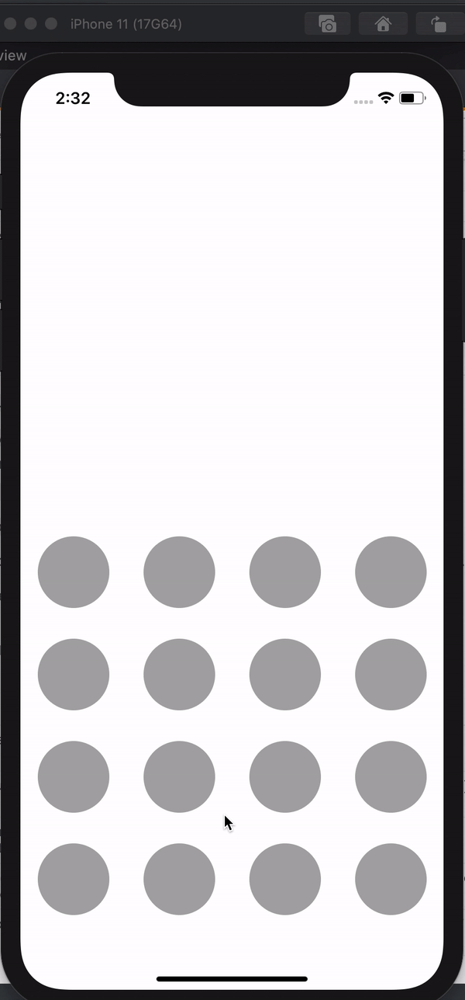

# UIStoryView


[](drawloginview.gif)

## Installation

DrawLoginView supports swift 5.0, iOS 10

1. Add pod DrawLoginView
2. Install the pods by running pod install.
3. Add import DrawLoginView in the .swift files where you want to use it.


## Basic Usage


```swift
@IBOutlet weak var drawLoginVew: DrawLoginView!

 drawLoginVew.rowColumnCount = 
 drawLoginVew.createRows()
 drawLoginVew.setOnMoveFinished { [weak self] (result) in
    print(result) // password
 }

```

